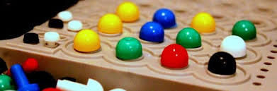

# Mastermind !!

## Content
- [Project Description](#project-description)
- [Mastermind](#games)
- [Project Goals](#project-goals)
- [How to use it](#How-to-use-it)
- [What's New ?](#What's New ?)

## Project Description
On this project we work in groups and create our first software in Python!
We choose the Masterming game 

## Mastermind
Mastermind  is a code-breaking game.It resembles an earlier pencil and paper game called Bulls and Cows that may date back a century.

## Project Goals
During this project we succeed to :
* Fork and manage our own git repository. 
* Plan our project.
* Build our own code from scratch. 
* Put into practice the basic Python concepts learned during the week.
* Get used to public presentations. 

## How to use it ?
The computer choose a combination of 4 elements with colors from the list: Black, Green, Blue, White, Yellow, Red and Pink
The user is asked to gess the combination in less or 12 tries.
He is asked to input his proposition using single letters: 
‘k' for Black ; ‘g’ for Green ; ‘b' for Blue ; ‘w’ for White ; ‘y’ for Yellow ; 'r’ for Red ; 'p’ for Pink
The computer will respond with the number of well placed elements, and the numbers of missplaced element with the right color.
The user will have only 12 tries to gess the combinaison

## What's New ?
What's new :
- new function RandomiseColor(L_Color_dictionary)

- new function inputCombination(L_Color_dictionary)
    - wrong input of user does not count for 1 turn
    - question is shorter, help is separated from question
    - user input '?' to display help again
    
- new function TestCombination(L_user_combination, L_computer_combination)
- bug in TestCombination: if the computer dice a combinaison with 1 or more identic color like ['g', 'y', 'k', 'y']
        missplaced element can be counted multiple time, abd shouldn't
        list is now copied and element are removed when 'in list' match

- G_PlayerScore: added good & missplaced score at the end
                 use a apped=nd to have multiline and save previous answers
                 [['k', 'k', 'k', 'k', 1, 0], ['k', 'k', 'p', 'k', 1, 1], ['k', 'p', 'b', 'y', 4, 0]]
                 
- new function DisplayUserConbinations(L_user_combination)
    to show user input in a tab like:
            |k|k|k|k|-|1|0|
            |y|k|k|k|-|1|1|
            |y|g|y|k|-|0|4|
        

- if loose, display the solution. It is so frustating without !!!
- added a 'while G_anothergame:' loop to play again
- at school all variables should start with G_ for global, L_ for local (inside functions)
- cheat mode added, read the code to find how to use it
- new function def GetColorCode(L_char)   adding color !!

## Good luck!

